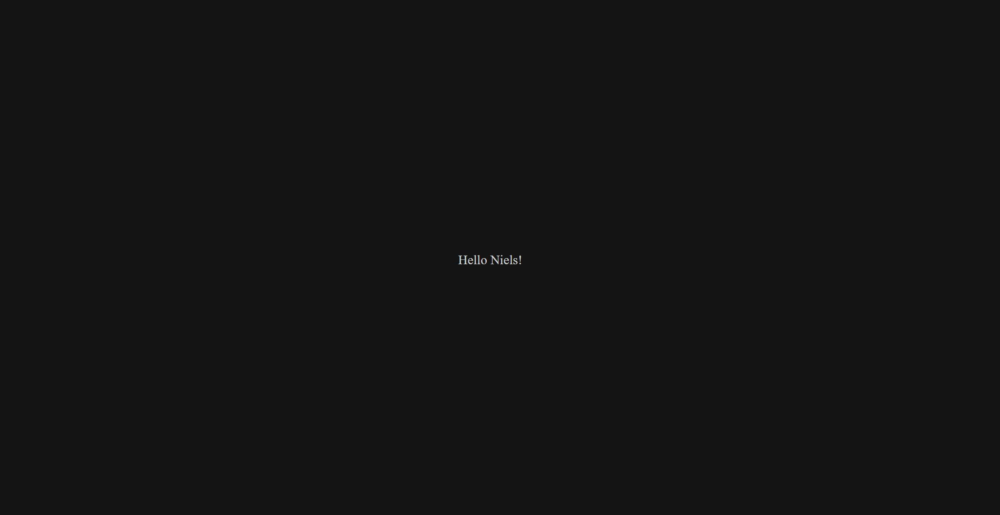

# Hello Niels

In this repository you find our HTML/Javascript implementation of an advanced *Hello World* program named after Prof. Niels Henze. This program was implemented in the context of the "Wissenschaftliches Arbeiten" course in the curriculum of the Medieninformatik B.A. at the University of Regensburg.

## Installation
To run our program a modern browser like Chrome, Firefox or Microsoft Edge (Chromium) is necessary. After downloading the repository content and unzipping the files it is sufficient to double click on the `index.html` file. This will open the program in your preferred standard browser.

To run the file in any other browser open up the browser and drag the `index.html` file to the tabs-bar.

## Description



When running our application the screen will start black. Every .5 seconds a new letter will appear untill the full **Hello Niels!** text has been written. Then the application will reset to the black screen.

### Implementation
To realise this functionality we used the Javascript setInterval function that calls a `write` function every 500ms. The timeout between function calls is stored in a constant.

```js
const FINISHED_SENTENCE = "Hello Niels!",
    WRITE_SPEED = 500;
var helloElement,
    timer;

function init() {
    helloElement = document.getElementById("hello_world");
    timer = setInterval(write, WRITE_SPEED);
}
```

In the called write function the current content of the text-HTML element is loaded using the `.innerHTML` attribute. If the text reached the full length it is reset to an empty string. If not the next letter, which is found at the position `currentContent.length` is added to the text.

```js
function write() {
    let currentContent = helloElement.innerHTML;
    if(currentContent.length === FINISHED_SENTENCE.length){
        currentContent = "";
    } else {
        currentContent = currentContent + FINISHED_SENTENCE.charAt(currentContent.length);
    }
    helloElement.innerHTML = currentContent;
}
```

Centering the text is done using a simple CSS flexbox.

```CSS
body {
    display: flex;
    align-items: center;
    text-align: center;
    background-color: rgb(20, 20, 20);
}

div {
    margin: auto;
}

#hello_world {
    text-align: center;
    margin: auto;
    font-size: 30;
    color: rgb(209, 209, 209);
}
```